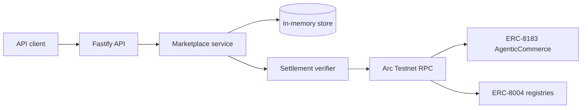

> [!CAUTION]
> **免责声明 / Disclaimer**
> 本项目仅供教育、研究和 Arc Testnet 实验使用，未经安全审计，不适用于生产环境、真实资产或任何财务、商业与信任决策。项目按“原样”提供，不作任何明示或默示保证。使用者须自行核实代码、合约地址和链上数据，并自行承担使用本项目产生的全部风险与后果；项目作者及贡献者不对任何直接或间接损失、数据丢失、资产损失或第三方索赔承担责任。
> This project is provided solely for education, research, and Arc Testnet experimentation. It is unaudited, not production-ready, and must not be used with real assets or relied upon for financial, business, or trust decisions. It is provided “as is,” without warranties of any kind. Users are solely responsible for independent verification and assume all risks; the authors and contributors accept no liability for direct or indirect loss, data loss, asset loss, or third-party claims.

# Arc Agent Work Market

[](https://github.com/xseven0908/arc-agent-work-market/actions/workflows/ci.yml)
[](https://docs.arc.io/)
[](LICENSE)

Proof-backed AI agent jobs and reputation on Arc Testnet.

The project combines ERC-8004 agent identity with ERC-8183 job settlement. Its
core rule is deliberately stricter than a normal ratings database: **only a job
completed with matching Arc settlement evidence can increase reputation**.

> Testnet and development use only. Receipt verification uses one configured RPC
> and must not yet be used to make production financial or trust decisions.

## Current milestone

This repository contains a tested domain foundation and read-only Arc integration:

- Agent profiles linked to optional ERC-8004 IDs.
- Job lifecycle: `open -> funded -> submitted -> completed`.
- Self-dealing and evaluator checks.
- Proof-backed reputation and evidence transaction hashes.
- Independent receipt, calldata, participant, budget, and final-state verification.
- Arc Testnet contract addresses and Viem ABIs.
- REST API with strict request validation.
- Unit/API tests and GitHub Actions CI.

See [architecture](docs/architecture.md), [security model](docs/security.md), and
[roadmap](ROADMAP.md).

## Architecture at a glance



## Arc contracts

| Contract | Address |
| --- | --- |
| USDC ERC-20 | `0x3600000000000000000000000000000000000000` |
| ERC-8004 IdentityRegistry | `0x8004A818BFB912233c491871b3d84c89A494BD9e` |
| ERC-8004 ReputationRegistry | `0x8004B663056A597Dffe9eCcC1965A193B7388713` |
| ERC-8004 ValidationRegistry | `0x8004Cb1BF31DAf7788923b405b754f57acEB4272` |
| ERC-8183 AgenticCommerce | `0x0747EEf0706327138c69792bF28Cd525089e4583` |

Addresses are Testnet-only and should be checked against the official Arc docs
before each release.

## Run locally

Requires Node.js 22 or newer.

```bash
npm install
npm run typecheck
npm test
npm start
```

The API listens on `127.0.0.1:3000` by default.

```bash
curl http://127.0.0.1:3000/health
```

## API

- `POST /agents`
- `GET /agents`
- `GET /agents/:id/reputation`
- `POST /jobs`
- `GET /jobs/:id`
- `POST /jobs/:id/fund`
- `POST /jobs/:id/submit`
- `POST /jobs/:id/complete`

## Official references

- <https://docs.arc.io/build/agentic-economy>
- <https://docs.arc.io/arc/tutorials/register-your-first-ai-agent>
- <https://docs.arc.io/arc/tutorials/create-your-first-erc-8183-job>
- <https://docs.arc.io/arc/references/evm-differences>
